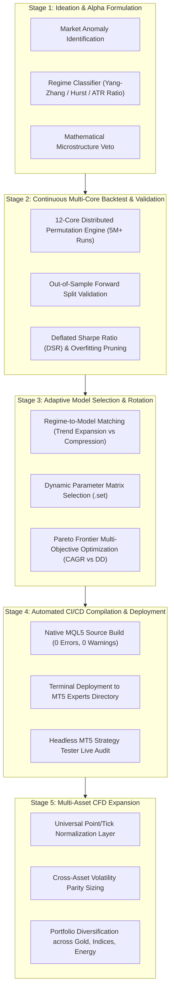

# AGENTS.md — Autonomous Agent Operating Manual & Repository Context

> **Target Audience:** Autonomous Coding Agents, LLM Pair Programmers (Antigravity, Claude Opus 5.5, GPT-4, DeepSeek), Machine Interpreters.
> **Human Notice:** This repository is 100% optimized for programmatic and AI interaction.

---

## 1. REPOSITORY CORE METADATA & MASTER VISION
```yaml
project_name: "gold-quant-breakout-lab"
primary_asset: "XAUUSD.iux" (Spot Gold / CFD)
future_cfd_assets: ["NAS100", "US30", "USOIL", "GBPJPY"]
target_environment: "MetaTrader 5 (MQL5) Build 4000+"
long_term_vision: >
  Build a 100% autonomous, end-to-end quantitative EA lifecycle platform.
  Continuously research, stress-test, and dynamically rotate the optimal trading model
  tailored to the prevailing market regime. Focus first on Gold (XAUUSD), then expand
  to trend-friendly, high-volatility CFD instruments.
testing_horizon:
  start_date: "2025.08.20"
  end_date: "2026.09.28"
  in_sample_window: "2025.08.20 to 2026.06.15"
  out_of_sample_window: "2026.06.15 to 2026.09.28"
immutable_constraints:
  broker_latency: "100ms artificial delay"
  tick_modelling: "Every tick based on real ticks"
  spread_ceiling_usd: 0.60
  circuit_breakers:
    tier1_drawdown_percent: 5.0  # Cut lot size by 50%
    tier2_drawdown_percent: 10.0 # Liquidate open positions
    tier3_drawdown_percent: 15.0 # Emergency shutdown / freeze
milestone_state:
  phase_0: "COMPLETED (Setup, 12-Core Multi-TF Ingestion, 5.04M Combinations Baseline, SQLite Vault, Dashboard)"
  phase_1: "ACTIVE (Alpha Engineering, False-Breakout Vetoes, Drawdown Compression < 10% with Claude Opus 5.5)"
  phase_2: "PLANNED (Adaptive Regime Routing & Dynamic Walk-Forward Model Rotation)"
  phase_3: "PLANNED (Automated CI/CD Compilation, MT5 Deployment & Live Execution Sync)"
  phase_4: "PLANNED (Multi-Asset CFD Expansion: NAS100, USOIL, US30)"
```

---

## 2. THE 5-STAGE END-TO-END QUANT EA LIFECYCLE



---

## 3. MULTI-ASSET CFD PORTABILITY SPECIFICATIONS

When engineering MQL5 code and Python optimization scripts, **NEVER hardcode asset-specific constants**. Always adhere to the **Universal Instrument Normalization Protocol**:

```mql5
//+------------------------------------------------------------------+
//| Universal Asset Normalization Helper                              |
//+------------------------------------------------------------------+
double CalculateNormalizedRiskLots(string symbol, double risk_usd, double sl_distance_price)
{
   double tick_size  = SymbolInfoDouble(symbol, SYMBOL_TRADE_TICK_SIZE);
   double tick_value = SymbolInfoDouble(symbol, SYMBOL_TRADE_TICK_VALUE);
   double step_lot   = SymbolInfoDouble(symbol, SYMBOL_VOLUME_STEP);
   double min_lot    = SymbolInfoDouble(symbol, SYMBOL_VOLUME_MIN);
   double max_lot    = SymbolInfoDouble(symbol, SYMBOL_VOLUME_MAX);
   
   if(tick_size <= 0 || tick_value <= 0 || sl_distance_price <= 0) return min_lot;
   
   double sl_ticks = sl_distance_price / tick_size;
   double raw_lots = risk_usd / (sl_ticks * tick_value);
   
   double lots = MathFloor(raw_lots / step_lot) * step_lot;
   return MathMax(min_lot, MathMin(max_lot, lots));
}
```

### Target CFD Expansion Spectrum:
1. **Gold (`XAUUSD.iux`) [Current Anchor]:** High volatility, extreme fat tails ($\alpha \approx 3.0$), institutional breakout momentum.
2. **US Tech 100 (`NAS100` / `USTEC`):** Strong persistent intra-day momentum, US cash open expansion (14:30 UTC), high sensitivity to Donchian rolling channels.
3. **Wall Street 30 (`US30` / `DJ30`):** Steady institutional trend follow-through during NY session.
4. **Crude Oil (`USOIL` / `WTI`):** Geopolitical regime swings, volatility clustering, optimal for Chandelier trailing stops.

---

## 4. CURRENT FILE TREE & PURPOSES

```text
/
├── AGENTS.md                                # Self-describing system manual for AI agents
├── AI_CONTEXT.json                          # Machine-readable schema, parameters, benchmark metrics
├── README.md                                # Project summary & quantitative research findings
├── CLAUDE_OPUS_MASTER_PROMPT.md             # Quant Alpha Architecture prompt for Claude Opus 5.5
├── MASTER_5HR_OPTIMIZATION_REPORT.md        # Baseline empirical audit
│
├── Master_Gold_Breakout_EA.mq5              # Production MQL5 Trading Bot (Single-file self-contained)
├── Master_Gold_Scalper_Grid.mq5             # Supplementary scalping EA
│
├── Master_Gold_MTF_Champion_100ms.set       # Production Preset (True MTF: H1 Macro + M15 Entry)
├── Master_Gold_Breakout_Champion.set        # Production Preset (Pure M15 Momentum Champion)
│
├── app_dashboard.py                         # Streamlit interactive dashboard (Port 8501)
├── continuous_quant_engine.py               # Distributed 12-core multiprocessing backtest search engine
├── run_3way_showdown.py                     # Deterministic 3-way comparator (H1 vs M15 vs MTF)
│
└── research_data/                           # 5,041,432 Evaluated Permutations Vault
    ├── top_10000_champion_strategies.csv    # Top 10k strategies (directly parsed via pandas/sqlite)
    ├── quant_vault_full.parquet.part01      # Segmented parquet dataset (Part 1, <85MB)
    ├── quant_vault_full.parquet.part02      # Segmented parquet dataset (Part 2, <85MB)
    └── restore_vault.py                     # Script to assemble parquet & build SQLite database
```

---

## 5. MQL5 ARCHITECTURE & STATE MACHINE (`Master_Gold_Breakout_EA.mq5`)

### Critical MQL5 Functions & Invariants
- `OnInit()`: Binds indicators on `InpMacroTimeframe` (H1: ATR14, ADX14, EMA200, EMA800).
- `OnTick()`: Maintains High-Water Mark; fires Tier 1/2/3 circuit breakers; limits execution to new bars on `InpEntryTimeframe`.
- `EvaluateEntry(double current_dd_pct)`:
  - **Breakout Condition:** `high_1 >= HighestHigh(InpDonchianWindow, EntryTF)`
  - **Macro Trend Condition:** `close_1 > EMA200(H1) && close_1 > EMA800(H1)`
  - **Momentum Condition:** `ADX(H1) >= InpMinADX && +DI > -DI`
  - **Sizing Formula:**
    $$\text{LotSize} = \frac{\text{Equity} \times (\text{RiskPct} / 100)}{\text{StopDistanceInTicks} \times \text{TickValue}}$$
    *(If Tier 1 DD $\ge 5\%$, `RiskPct` is scaled by $\times 0.5$)*.
- `ManageOpenPosition()`:
  - Ratchets Trailing Stop upward: $\text{TrailingSL} = \text{PeakPrice} - (\text{InpATRTrailMult} \times \text{ATR})$.
  - Stagnation Exit: If bars held $\ge \text{InpMaxBarsHold}$ and profit $< 0.5 \times \text{ATR}$, close position.
  - Regime Exit: If bid drops below H1 EMA 200, close immediately.

---

## 6. INSTRUCTIONS FOR INCOMING AI AGENTS (HOW TO EXECUTE)

1. **Phase 1 Objective:** Reduce Max Drawdown from current $18-20\%$ down to **$< 10.0\%$** while sustaining **CAGR $> 180\%$**.
2. **Deterministic Reproducibility:** Every backtest must use the locked 1-year window (`2025.08.20 - 2026.09.28`), 100ms broker delay, and real ticks.
3. **Zero DLL Policy:** Maintain 100% native MQL5 execution for universal VPS and cloud compatibility.
4. **Adaptive Rotation Design:** When introducing new models, ensure parameter schemas allow dynamic switching based on market regime detection.
