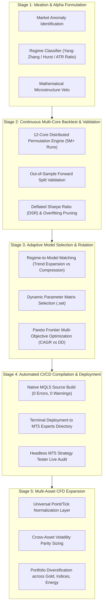

# AGENTS.md — Autonomous Agent Operating Manual & Repository Context

> **Target Audience:** Autonomous Coding Agents, LLM Pair Programmers (Antigravity, Claude Opus 5.5, GPT-4, DeepSeek), Machine Interpreters.
> **Human Notice:** This repository is 100% optimized for programmatic and AI interaction.

---

## 1. REPOSITORY CORE METADATA & MASTER VISION
```yaml
project_name: "gold-quant-breakout-lab"
primary_asset: "XAUUSD" (Precious Metal)
the_5_specialized_assets: ["XAUUSD", "NAS100", "GBPJPY", "USOIL", "BTCUSD"]
target_environment: "MetaTrader 5 (MQL5) Build 4000+"
account_architecture: "Single Shared Account ($25,000 Pool, Risk 0.25% per trade, Max Concurrent Risk <= 1.25%)"
master_mandate: >
  Build 5 dedicated specialized Model EAs engineered specifically for each asset's unique DNA.
  Execute a disciplined sequential roadmap: Perfect ONE asset at a time (1M -> 4M -> 1Y -> 10Y -> Forward Test -> Deploy)
  before researching the next asset. Conclude with all 5 Model EAs cooperating seamlessly in 1 account.
core_invariants:
  equity_curve: "Must be a monotonically increasing UP-TREND across all horizons; drawdown > 2 weeks strictly prohibited"
  trade_frequency: "Active trading frequency; no prolonged multi-week dormancy"
  risk_per_trade: "0.25% of balance ($62.50 on $25,000 base) with unclamped 0.01 lot minimum execution"
  execution_mode: "Hybrid Breakout + Trend Following (Both BUY and SELL)"
  directional_state_machine: "Single-side persistence; flip only on loss + confirmed macro trend transition"
  min_reward_risk: "1:1.25 to 1:1.50 Take Profit with fast breakeven at +0.85R to bank alpha consistently"
  anti_sideway_veto: "Kaufman Efficiency Ratio (KER >= 0.35); strict 100% cash veto in choppy regimes"
  database_policy: "100% Pure SQLite (quant_vault.db & quant_journal.sqlite); ZERO CSV Policy"
milestone_state:
  step_1_active: "Model 1: Model_Gold_Specialist (Range 1M Equity Uptrend Proof-of-Concept)"
  step_2_planned: "Model 1: Range 4M (Quarterly Robustness Verification)"
  step_3_planned: "Model 1: Range 1Y (Annual Stability, Calmar/SQN A+ Tier)"
  step_4_planned: "Model 1: Range 10Y (Multi-Regime Stress Test 2016-2026)"
  step_5_planned: "Sequential Expansion to Model 2 (NAS100), Model 3 (GBPJPY), Model 4 (USOIL), Model 5 (BTCUSD)"
  step_6_planned: "Unified 5-Model Concurrent Live Deployment on Single $25,000 Account"
```

---

## 2. THE 5-STAGE END-TO-END QUANT EA LIFECYCLE



---

## 3. MULTI-ASSET CFD PORTABILITY SPECIFICATIONS

When engineering MQL5 code and Python optimization scripts, **NEVER hardcode asset-specific constants**. Always adhere to the **Universal Instrument Normalization Protocol**:

```mql5
//+------------------------------------------------------------------+
//| Universal Asset Normalization Helper                              |
//+------------------------------------------------------------------+
double CalculateNormalizedRiskLots(string symbol, double risk_usd, double sl_distance_price)
{
   double tick_size  = SymbolInfoDouble(symbol, SYMBOL_TRADE_TICK_SIZE);
   double tick_value = SymbolInfoDouble(symbol, SYMBOL_TRADE_TICK_VALUE);
   double step_lot   = SymbolInfoDouble(symbol, SYMBOL_VOLUME_STEP);
   double min_lot    = SymbolInfoDouble(symbol, SYMBOL_VOLUME_MIN);
   double max_lot    = SymbolInfoDouble(symbol, SYMBOL_VOLUME_MAX);
   
   if(tick_size <= 0 || tick_value <= 0 || sl_distance_price <= 0) return min_lot;
   
   double sl_ticks = sl_distance_price / tick_size;
   double raw_lots = risk_usd / (sl_ticks * tick_value);
   
   double lots = MathFloor(raw_lots / step_lot) * step_lot;
   return MathMax(min_lot, MathMin(max_lot, lots));
}
```

### Target CFD Expansion Spectrum:
1. **Gold (`XAUUSD.iux`) [Current Anchor]:** High volatility, extreme fat tails ($\alpha \approx 3.0$), institutional breakout momentum.
2. **US Tech 100 (`NAS100` / `USTEC`):** Strong persistent intra-day momentum, US cash open expansion (14:30 UTC), high sensitivity to Donchian rolling channels.
3. **Wall Street 30 (`US30` / `DJ30`):** Steady institutional trend follow-through during NY session.
4. **Crude Oil (`USOIL` / `WTI`):** Geopolitical regime swings, volatility clustering, optimal for Chandelier trailing stops.

---

## 4. CURRENT FILE TREE & PURPOSES

```text
/
├── AGENTS.md                                # Self-describing system manual for AI agents
├── AI_CONTEXT.json                          # Machine-readable schema, parameters, benchmark metrics
├── README.md                                # Project summary & quantitative research findings
├── CLAUDE_OPUS_MASTER_PROMPT.md             # Quant Alpha Architecture prompt for Claude Opus 5.5
├── MASTER_5HR_OPTIMIZATION_REPORT.md        # Baseline empirical audit
│
├── Master_Gold_Breakout_EA.mq5              # Production MQL5 Trading Bot (Single-file self-contained)
├── Master_Gold_Scalper_Grid.mq5             # Supplementary scalping EA
│
├── Master_Gold_MTF_Champion_100ms.set       # Production Preset (True MTF: H1 Macro + M15 Entry)
├── Master_Gold_Breakout_Champion.set        # Production Preset (Pure M15 Momentum Champion)
│
├── app_dashboard.py                         # Streamlit interactive dashboard (Port 8501)
├── continuous_quant_engine.py               # Distributed 12-core multiprocessing backtest search engine
├── run_3way_showdown.py                     # Deterministic 3-way comparator (H1 vs M15 vs MTF)
│
└── research_data/                           # 5,041,432 Evaluated Permutations Vault
    ├── top_10000_champion_strategies.csv    # Top 10k strategies (directly parsed via pandas/sqlite)
    ├── quant_vault_full.parquet.part01      # Segmented parquet dataset (Part 1, <85MB)
    ├── quant_vault_full.parquet.part02      # Segmented parquet dataset (Part 2, <85MB)
    └── restore_vault.py                     # Script to assemble parquet & build SQLite database
```

---

## 5. MQL5 ARCHITECTURE & STATE MACHINE (`Master_Gold_Breakout_EA.mq5`)

### Critical MQL5 Functions & Invariants
- `OnInit()`: Binds indicators on `InpMacroTimeframe` (H1: ATR14, ADX14, EMA200, EMA800).
- `OnTick()`: Maintains High-Water Mark; fires Tier 1/2/3 circuit breakers; limits execution to new bars on `InpEntryTimeframe`.
- `EvaluateEntry(double current_dd_pct)`:
  - **Breakout Condition:** `high_1 >= HighestHigh(InpDonchianWindow, EntryTF)`
  - **Macro Trend Condition:** `close_1 > EMA200(H1) && close_1 > EMA800(H1)`
  - **Momentum Condition:** `ADX(H1) >= InpMinADX && +DI > -DI`
  - **Sizing Formula:**
    $$\text{LotSize} = \frac{\text{Equity} \times (\text{RiskPct} / 100)}{\text{StopDistanceInTicks} \times \text{TickValue}}$$
    *(If Tier 1 DD $\ge 5\%$, `RiskPct` is scaled by $\times 0.5$)*.
- `ManageOpenPosition()`:
  - Ratchets Trailing Stop upward: $\text{TrailingSL} = \text{PeakPrice} - (\text{InpATRTrailMult} \times \text{ATR})$.
  - Stagnation Exit: If bars held $\ge \text{InpMaxBarsHold}$ and profit $< 0.5 \times \text{ATR}$, close position.
  - Regime Exit: If bid drops below H1 EMA 200, close immediately.

---

## 6. INSTRUCTIONS FOR INCOMING AI AGENTS (HOW TO EXECUTE)

1. **Sequential 5-Asset Mastery:** Focus 100% compute on perfecting ONE asset at a time.
   - Current Target: `Model 1: Model_Gold_Specialist.mq5` (Gold Spot XAUUSD).
   - Milestone Progression: 1M Range (Uptrend POC) -> 4M Range (Quarterly Robustness) -> 1Y Range (Calmar/SQN A+) -> 10Y Range (Stress Test) -> Live Forward Audit.
   - Once certified, proceed to `Model 2: NAS100`, `Model 3: GBPJPY`, `Model 4: USOIL`, `Model 5: BTCUSD`.
2. **Capital Allocation Policy ($25,000 Shared Risk Pool):**
   - DO NOT fragment the $25,000 into $5,000 silos.
   - Run all 5 specialized models on ONE single account using a Shared Liquidity Pool.
   - Each model sizes risk dynamically at `0.25%` ($62.50 per trade) of the total account balance.
   - Max concurrent portfolio exposure is capped at $\le 1.25\%$ (5 open trades maximum), leaving a massive $3.75\%$ safety buffer before FTMO's $5.0\%$ daily loss limit.
3. **Core Alpha Mandates:**
   - Directional State Machine: Trade one side at a time; flip only on verified loss + confirmed EMA cross.
   - High Win-Rate Alpha Banking: Min RR = 1:1.25 to 1:1.50 Take Profit with fast breakeven lock at $+0.85R$.
   - Anti-Sideway Protection: Kaufman Efficiency Ratio ($KER \ge 0.35$) mandatory entry veto.
4. **Zero CSV Policy:**
   - All optimizations, genetic sweeps, and trade logs must use SQLite (`quant_vault.db` and native MQL5 `quant_journal.sqlite`).
5. **Zero DLL Policy:** Maintain 100% native MQL5 execution for universal cloud/VPS compatibility.
