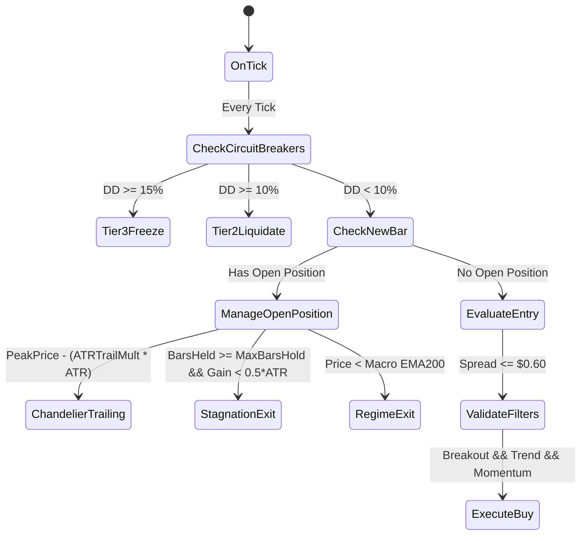

# AGENTS.md — Autonomous Agent Operating Manual & Repository Context

> **Target Audience:** Autonomous Coding Agents, LLM Pair Programmers (Antigravity, Claude Opus 5.5, GPT-4, DeepSeek), Machine Interpreters.
> **Human Notice:** This repository is 100% optimized for programmatic and AI interaction.

---

## 1. REPOSITORY CORE METADATA
```yaml
project_name: "gold-quant-breakout-lab"
asset: "XAUUSD.iux"
market_type: "Spot Gold / CFD"
target_environment: "MetaTrader 5 (MQL5) Build 4000+"
testing_horizon:
  start_date: "2025.08.20"
  end_date: "2026.09.28"
  in_sample_window: "2025.08.20 to 2026.06.15"
  out_of_sample_window: "2026.06.15 to 2026.09.28"
immutable_constraints:
  broker_latency: "100ms artificial delay"
  tick_modelling: "Every tick based on real ticks"
  spread_ceiling_usd: 0.60
  circuit_breakers:
    tier1_drawdown_percent: 5.0  # Cut lot size by 50%
    tier2_drawdown_percent: 10.0 # Liquidate open positions
    tier3_drawdown_percent: 15.0 # Emergency shutdown / freeze
current_milestone: "Phase 0 Completed (Setup & 5M Baseline) -> Entering Phase 1 (Alpha Refinement)"
```

---

## 2. FILE TREE & ARCHITECTURAL PURPOSES

```text
/
├── AGENTS.md                                # Self-describing system manual for AI agents
├── AI_CONTEXT.json                          # Machine-readable schema, parameters, benchmark metrics
├── README.md                                # Project summary & quantitative research findings
├── CLAUDE_OPUS_MASTER_PROMPT.md             # Quant Alpha Architecture prompt for Claude Opus 5.5
├── MASTER_5HR_OPTIMIZATION_REPORT.md        # Baseline empirical audit
│
├── Master_Gold_Breakout_EA.mq5              # Production MQL5 Trading Bot (Single-file self-contained)
├── Master_Gold_Scalper_Grid.mq5             # Supplementary scalping EA
│
├── Master_Gold_MTF_Champion_100ms.set       # Production Preset (True MTF: H1 Macro + M15 Entry)
├── Master_Gold_Breakout_Champion.set        # Production Preset (Pure M15 Momentum Champion)
│
├── app_dashboard.py                         # Streamlit interactive dashboard (Port 8501)
├── continuous_quant_engine.py               # Distributed 12-core multiprocessing backtest search engine
├── run_3way_showdown.py                     # Deterministic 3-way comparator (H1 vs M15 vs MTF)
│
└── research_data/                           # 5,041,432 Evaluated Permutations Vault
    ├── top_10000_champion_strategies.csv    # Top 10k strategies (directly parsed via pandas/sqlite)
    ├── quant_vault_full.parquet.part01      # Segmented parquet dataset (Part 1, <85MB)
    ├── quant_vault_full.parquet.part02      # Segmented parquet dataset (Part 2, <85MB)
    └── restore_vault.py                     # Script to assemble parquet & build SQLite database
```

---

## 3. MQL5 ARCHITECTURE & STATE MACHINE (`Master_Gold_Breakout_EA.mq5`)

### Execution Flowchart


### Critical MQL5 Functions & Invariants
- `OnInit()`: Binds indicators on `InpMacroTimeframe` (H1: ATR14, ADX14, EMA200, EMA800).
- `OnTick()`: Maintains High-Water Mark; fires Tier 1/2/3 circuit breakers; limits execution to new bars on `InpEntryTimeframe`.
- `EvaluateEntry(double current_dd_pct)`:
  - **Breakout Condition:** `high_1 >= HighestHigh(InpDonchianWindow, EntryTF)`
  - **Macro Trend Condition:** `close_1 > EMA200(H1) && close_1 > EMA800(H1)`
  - **Momentum Condition:** `ADX(H1) >= InpMinADX && +DI > -DI`
  - **Sizing Formula:**
    $$\text{LotSize} = \frac{\text{Equity} \times (\text{RiskPct} / 100)}{\text{StopDistanceInTicks} \times \text{TickValue}}$$
    *(If Tier 1 DD $\ge 5\%$, `RiskPct` is scaled by $\times 0.5$)*.
- `ManageOpenPosition()`:
  - Ratchets Trailing Stop upward: $\text{TrailingSL} = \text{PeakPrice} - (\text{InpATRTrailMult} \times \text{ATR})$.
  - Stagnation Exit: If bars held $\ge \text{InpMaxBarsHold}$ and profit $< 0.5 \times \text{ATR}$, close position.
  - Regime Exit: If bid drops below H1 EMA 200, close immediately.

---

## 4. DATABASE SCHEMA (`quant_vault.db` & Parquet)

Table name: `results`

| Column | Type | Description |
| :--- | :---: | :--- |
| `timeframe` | `TEXT` | `M15`, `M30`, or `H1` |
| `donchian` | `INTEGER` | Channel lookback bars ($10 - 120$) |
| `atr_trail` | `REAL` | Trailing stop multiplier ($2.0 - 6.0$) |
| `atr_stop` | `REAL` | Initial stop multiplier ($1.0 - 3.0$) |
| `risk` | `REAL` | Account risk fraction ($0.01 - 0.05$) |
| `min_adx` | `REAL` | Minimum ADX momentum floor ($15.0 - 30.0$) |
| `max_hold` | `INTEGER` | Stagnation bar limit ($48 - 192$) |
| `is_cagr` | `REAL` | In-Sample CAGR fraction (e.g. `5.005` = +500.5%) |
| `is_dd` | `REAL` | In-Sample Max Drawdown (e.g. `-0.198` = -19.8%) |
| `is_pf` | `REAL` | In-Sample Profit Factor |
| `oos_cagr` | `REAL` | Out-Of-Sample Forward CAGR (Recent 3.5 months) |
| `oos_dd` | `REAL` | Out-Of-Sample Max Drawdown |
| `oos_pf` | `REAL` | Out-Of-Sample Profit Factor |
| `full_cagr` | `REAL` | Full 1-Year CAGR across entire window |
| `full_dd` | `REAL` | Full 1-Year Max Drawdown |
| `full_pf` | `REAL` | Full 1-Year Profit Factor |
| `trades` | `INTEGER` | Total executed trade count |

---

## 5. REPRODUCIBLE AGENT CLI COMMANDS

### Rebuild SQLite Vault from Git Segments:
```bash
python research_data/restore_vault.py
```

### Launch Interactive Web Dashboard:
```bash
python -m streamlit run app_dashboard.py --server.port 8501 --server.headless true
```

### Run 12-Core Continuous Optimization Wave:
```bash
python continuous_quant_engine.py
```

### Run Deterministic 3-Way Showdown Verification:
```bash
python run_3way_showdown.py
```

---

## 6. INSTRUCTIONS FOR INCOMING AI AGENTS (HOW TO CONTRIBUTE)

1. **Never alter immutable constraints:** 100ms latency, real ticks, 5%/10%/15% circuit breakers, and spread cap ($0.60) must remain fixed to avoid curve-fitting illusions.
2. **Phase 1 Objective:** Reduce Max Drawdown from current $18-20\%$ down to **$< 10.0\%$** while sustaining **CAGR $> 180\%$**.
3. **Integrating New Alpha:** When introducing non-lagging regime indicators (e.g., Yang-Zhang, Hurst Exponent) or order-flow vetoes, write modular native MQL5 functions with zero external DLL dependencies.
