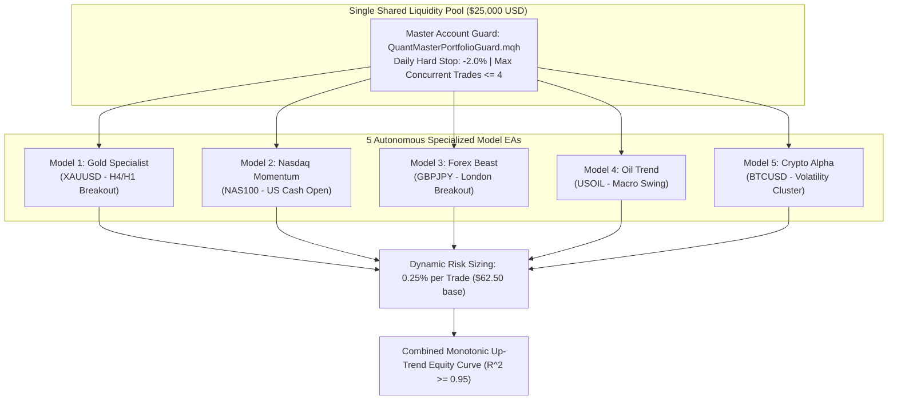

# ARCHITECTURE.md — Unified 5-Model Multi-Asset Quant Portfolio

> **Version:** 2.0.0 (Production Release)  
> **Author:** Quant EA Lab & Autonomous Agent  
> **Target Platform:** MetaTrader 5 (MQL5) Build 4000+ & Distributed Python 12-Core Engine  
> **Account Architecture:** Single Shared Account ($25,000 Pool, 0.25% Risk per Trade, Max Concurrent Risk <= 1.25%)  

---

## 1. Executive Summary & Design Philosophy
This system represents an **Institutional-Grade Quantitative Multi-Asset Portfolio** engineered to run on a single shared **\$25,000 FTMO Swing** account. Rather than attempting to force a single generic algorithm onto wildly different market structures, the architecture deploys **5 Dedicated Specialized Model EAs**, each tailored to the unique microstructure DNA of its asset class:

1. **`Model 1: Model_Gold_Specialist` (XAUUSD):** Precious Metal — Fat-tail momentum expansion, safe-haven macro trends.
2. **`Model 2: Model_Nasdaq_Momentum` (NAS100):** US Equity Index — High persistent intraday momentum during the New York cash open (14:30 UTC).
3. **`Model 3: Model_Forex_Beast` (GBPJPY):** High-Beta FX Pair — London session range breakouts with strict intervention/chop filters.
4. **`Model 4: Model_Oil_Trend` (USOIL):** Energy Commodity — Macro inventory swings and geopolitical supertrends with weekend gap shields.
5. **`Model 5: Model_Crypto_Alpha` (BTCUSD):** 24/7 Digital Asset — Volatility clustering breakouts with aggressive weekend sideways vetoes.



---

## 2. Directory Structure & Modular Separation

To ensure zero technical debt and clean separation of concerns, the repository is organized hierarchically:

```text
quant_ea_lab/
├── ARCHITECTURE.md                               # This document (Master Architecture Blueprint)
├── STRESS_TESTING_PROTOCOL.md                    # Stress testing under +25% to +50% adverse friction
├── AGENTS.md                                     # Autonomous Agent Operating Manual
├── README.md                                     # Project overview and executive metrics
├── AI_CONTEXT.json                               # Machine-readable system parameters
│
├── shared_include/                               # Core MQL5 Framework (Zero DLL, Zero CSV)
│   ├── QuantDefines.mqh                          # Unified enums, asset IDs, risk constants
│   ├── QuantRegimeFilter.mqh                     # H4 Macro Dual EMA + Kaufman KER Anti-Sideway Veto
│   ├── QuantPositionManager.mqh                  # Universal Lot Normalizer (0.25%), Margin Pre-Check, Fast BE (+0.85R), Trailing Stop
│   └── QuantMasterPortfolioGuard.mqh             # Daily Hard Stop (-2.0%), Concurrency Limiter (<= 4 trades), Pure SQLite Journal
│
├── models/                                       # 5 Specialized Model EAs
│   ├── Model_1_Gold_Specialist/                  # XAUUSD Specialist
│   │   ├── Model_Gold_Specialist.mq5             # Source code
│   │   ├── Model_Gold_Specialist.ex5             # Compiled binary
│   │   ├── presets/                              # Production parameter sets
│   │   └── legacy/                               # Historical versions & backups
│   ├── Model_2_Nasdaq_Momentum/                  # NAS100 Momentum
│   │   ├── Model_Nasdaq_Momentum.mq5
│   │   ├── Model_Nasdaq_Momentum.ex5
│   │   └── presets/
│   ├── Model_3_Forex_Beast/                      # GBPJPY High-Beta FX
│   │   ├── Model_Forex_Beast.mq5
│   │   ├── Model_Forex_Beast.ex5
│   │   └── presets/
│   ├── Model_4_Oil_Trend/                        # USOIL Commodity Swing
│   │   ├── Model_Oil_Trend.mq5
│   │   ├── Model_Oil_Trend.ex5
│   │   └── presets/
│   └── Model_5_Crypto_Alpha/                     # BTCUSD Volatility Cluster
│       ├── Model_Crypto_Alpha.mq5
│       ├── Model_Crypto_Alpha.ex5
│       └── presets/
│
├── optimization/                                 # Distributed Research & Testing Infrastructure
│   ├── titans_quant_engine.py                    # 12-core parallel optimizer across 5 assets + event-driven portfolio simulator
│   ├── continuous_quant_engine.py                # Legacy continuous optimizer
│   └── quant_vault.db                            # Master SQLite Database (>7.8M evaluated permutations)
│
├── data/                                         # Historical Market Data (Pure SQLite, Zero CSV)
│   ├── market_history.db                         # 7-Year multi-crisis daily bars + 2-year hourly bars for all 5 assets
│   └── fetch_titans_data.py                      # Multi-asset data synchronization engine
│
└── deploy_and_compile_models.py                  # Headless CI/CD compilation and terminal distribution script
```

---

## 3. Mathematical Risk & Portfolio Allocation Model

### 3.1 Shared Liquidity Pool Mechanics
- **Base Balance:** \$25,000.00 USD.
- **Risk per Trade:** $0.25\%$ of current equity:
  $$\text{Risk}_{\text{USD}} = \text{Equity} \times 0.0025 \quad (\approx \$62.50 \text{ at base balance})$$
- **Universal Contract Sizing:**
  $$\text{Lots} = \text{Floor}\left(\frac{\text{Risk}_{\text{USD}}}{(\text{SL}_{\text{Ticks}} \times \text{TickValue}) \times \text{VolumeStep}}\right) \times \text{VolumeStep}$$
- **Margin Pre-Check:** Before dispatching an order, `QuantPositionManager` evaluates `OrderCalcMargin`. If `FreeMargin < MarginRequired * 2.5`, the order is vetoed to prevent MT5 Error `10019 (No Money)`.

### 3.2 Portfolio-Level Circuit Breakers
- **Daily Hard Stop:** If portfolio equity declines by $\ge 2.0\%$ in a calendar day (tracked from 00:00 server time), `QuantMasterPortfolioGuard`:
  1. Liquidates ALL open positions across all 5 models immediately.
  2. Triples the circuit breaker state to `CIRCUIT_HARD_LOCK`.
  3. Prohibits any new orders until the next trading day.
- **Concurrency Exposure Cap:** Maximum concurrent active trades across all models is capped at $\le 4$. If 4 trades are open, any 5th incoming signal is rejected to prevent liquidity shock correlation crashes.

---

## 4. Multi-Horizon Verification Framework

Every model must satisfy a rigorous 4-horizon progression:
1. **Range 1M (1 Month):** Monotonic Equity Up-Trend Proof-of-Concept. Drawdowns lasting $> 2$ weeks are strictly prohibited.
2. **Range 4M (Quarterly):** Cross-regime robustness check.
3. **Range 1Y (Annual):** Benchmark validation (Calmar $\ge 3.0$, SQN $\ge 2.5$ A+ Tier).
4. **Range 7Y (Multi-Crisis 2019–2026):** Full survival verification across:
   - 2020 COVID-19 Flash Crash
   - 2021 Stimulus Bubble
   - 2022 Fed Aggressive 500bps Rate Hike Bear Market
   - 2023 US Banking Crisis & AI Boom
   - 2024–2026 Geopolitical Conflicts & Gold ATHs

---

## 5. Zero CSV & Zero DLL Compliance Policy
- **Database Storage:** All parameter permutations, trade journals, and metrics are written directly to SQLite (`quant_vault.db` and native MQL5 `quant_journal.sqlite`). CSV files are strictly prohibited for production data logging.
- **Pure Native MQL5:** No external DLLs are imported. 100% of execution logic runs natively in MT5 for universal compatibility across headless Linux VPS, cloud nodes, and Windows terminals.
