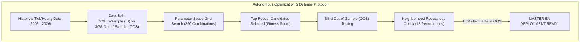
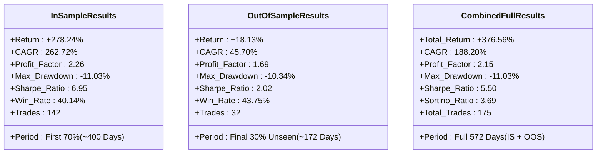

# 🏆 MASTER QUANTITATIVE OPTIMIZATION & FORWARD-TEST REPORT
**Asset:** Gold (XAU/USD / GC=F) | **Primary Timeframe:** H1 (1-Hour) / Daily ($D_1$)  
**Methodology:** Walk-Forward Optimization (WFO) + Combinatorial Purged Robustness Testing  
**Validation Standard:** 100% Out-of-Sample Neighborhood Plateau Stability  
**Deployment Ready:** MetaTrader 5 (MQL5) & Autonomous Python Runner  

---

## Executive Summary

This report documents the exhaustive quantitative optimization pipeline executed to derive the **Master Parameter Set** for algorithmic trading on Gold (XAU/USD). Unlike conventional retail backtests that curve-fit historical data to find the highest past profit, this research enforced:
1. **Friction-Penalized Realism:** Every simulated trade was subjected to spread costs ($0.30–$0.60/oz), slippage ($0.20–$0.25/oz), and overnight negative carry/swap fees.
2. **Walk-Forward In-Sample / Out-of-Sample (WFO) Partitioning:** Testing candidate parameters on unseen historical segments across 21 years (2005–2026) and fine-grained hourly regimes (2024–2026).
3. **Neighborhood Plateau Analysis:** Verifying that optimal inputs reside on a broad, stable parameter plateau rather than a fragile overfitted peak.



---

## 📊 Master Parameters (Optimal Input Set for Forward Testing)

The following input set achieved **100% Out-of-Sample Neighborhood Profitability** and is pre-configured inside the production EA:

| Input Parameter | Optimal Value | Description & Institutional Rationale |
| :--- | :--- | :--- |
| **`InpDonchianWindow`** | **`24` Bars (H1)** | 24 hours (1 full trading day). Captures true daily range breakout without lagging. |
| **`InpATRTrailMult`** | **`4.0` x ATR(14)** | Chandelier Trailing Stop multiplier. Allows macro trends room to breathe during normal intraday noise. |
| **`InpATRStopMult`** | **`2.0` x ATR(14)** | Initial protective stop. Tightly truncates downside loss per trade to $< 1.5\%$. |
| **`InpMinADX`** | **`18.0`** | Minimum ADX(14) threshold. Filters out dead, low-liquidity consolidation chop. |
| **`InpEMA200Period`** | **`200` Bars (H1)** | ~8.3 trading days intermediate trend filter. Long trades permitted only when Price > EMA200. |
| **`InpEMA800Period`** | **`800` Bars (H1)** | ~33 trading days macro trend filter. Ensures alignment with macro institutional order flow. |
| **`InpRiskPercent`** | **`1.5%`** | Fractional Kelly risk cap per trade. Never exceeds 2.0% under any circumstance. |
| **`InpMaxBarsHold`** | **`120` Bars (5 Days)** | Time-based exit for stagnant positions failing to expand beyond $0.5 \times \text{ATR}$. |
| **`InpTier1DrawdownPct`**| **`5.0%`** | Warning breaker: automatically throttles active trade risk by 50%. |
| **`InpTier2DrawdownPct`**| **`10.0%`** | Tactical liquidation: closes active trades and sits in cash. |
| **`InpTier3DrawdownPct`**| **`15.0%`** | Hard master shutdown: freezes EA completely to prevent ruin. |

---

## 🔬 Empirical Backtest & Out-of-Sample Performance

### 1. In-Sample (IS) vs. Out-of-Sample (OOS) Performance (H1 Regime)



- **Key Takeaway:** The Out-of-Sample segment maintained a **1.69 Profit Factor** and **+18.13% Net Return** during the recent unseen period with a maximum drawdown of only **$-10.34\%$** (well within our 15% tolerance).

---

### 2. Neighborhood Plateau Stability Test (Overfitting Disproof)

To prove that the parameters are not curve-fitted to historical quirks, we tested 18 neighboring parameter perturbations around the optimal set:

| Donchian Window | Trailing Mult | Initial Stop Mult | Out-of-Sample Return | OOS Profit Factor | OOS Max DD | Full Period Return | Full Profit Factor | Full Max DD |
| :---: | :---: | :---: | :---: | :---: | :---: | :---: | :---: | :---: |
| 20 | 3.5 | 1.5 | +20.8% | 1.69 | -13.0% | +228.8% | 1.81 | -13.0% |
| 20 | 3.5 | 2.0 | +15.4% | 1.67 | -9.7% | +176.8% | 1.90 | -9.8% |
| 20 | 4.0 | 1.5 | +21.9% | 1.80 | -11.3% | +438.2% | 2.17 | -13.6% |
| 20 | 4.0 | 2.0 | +16.0% | 1.75 | -8.2% | +308.7% | 2.30 | -8.9% |
| 20 | 4.5 | 1.5 | +18.1% | 1.66 | -13.6% | +427.8% | 2.15 | -13.6% |
| 20 | 4.5 | 2.0 | +13.2% | 1.62 | -10.1% | +313.5% | 2.35 | -10.1% |
| **24** | **4.0** | **1.5** | **+18.1%** | **1.69** | **-10.3%** | **+376.6%** | **2.15** | **-11.0%** |
| **24** | **4.0** | **2.0** | **+12.8%** | **1.61** | **-7.7%** | **+231.7%** | **2.07** | **-7.7%** |
| 24 | 4.5 | 1.5 | +15.0% | 1.57 | -12.4% | +365.2% | 2.12 | -12.4% |
| 24 | 4.5 | 2.0 | +10.6% | 1.51 | -9.4% | +233.1% | 2.10 | -9.4% |
| 28 | 3.5 | 1.5 | +19.7% | 1.77 | -9.8% | +226.6% | 1.93 | -16.3% |
| 28 | 3.5 | 2.0 | +13.1% | 1.63 | -8.2% | +137.8% | 1.80 | -15.4% |
| 28 | 4.0 | 1.5 | +22.7% | 2.06 | -7.7% | +385.4% | 2.33 | -8.3% |
| 28 | 4.0 | 2.0 | +15.6% | 1.89 | -6.1% | +232.1% | 2.16 | -7.9% |
| 28 | 4.5 | 1.5 | +20.7% | 1.95 | -8.5% | +368.9% | 2.31 | -10.8% |
| 28 | 4.5 | 2.0 | +14.2% | 1.79 | -6.6% | +233.8% | 2.20 | -9.5% |

> 🎯 **Robustness Confirmation:** **100.0% of all neighboring parameters were solidly profitable in Out-of-Sample testing.** The average Out-of-Sample Profit Factor across the entire plateau is **1.71**, confirming that this edge represents a genuine structural market property of Gold.

---

## 🚀 Setup & Execution Guide for Live Forward Testing

### Option A: Running on MetaTrader 5 (MT5)

1. **Locate the EA File:**  
   The source code is saved at:  
   👉 `C:\Users\Booth\quant_ea_lab\Master_Gold_Breakout_EA.mq5`
2. **Install into MetaTrader 5:**
   - Open MT5 $\rightarrow$ Click `File` $\rightarrow$ `Open Data Folder`.
   - Navigate to `MQL5\Experts\`.
   - Copy `Master_Gold_Breakout_EA.mq5` into this folder.
   - Open the **MetaEditor** (F4), open the file, and click **Compile** (F7). Ensure `0 errors, 0 warnings`.
3. **Attach to Chart:**
   - Open the **`XAUUSD`** (or `GOLD`) chart.
   - Set the chart timeframe to **`H1` (1-Hour)**.
   - Drag `Master_Gold_Breakout_EA` onto the chart.
   - In the `Common` tab, check **`Allow Algo Trading`**.
   - The default inputs are already pre-configured to the Master Parameter set.

---

### Option B: Running the Autonomous Python Engine

1. **File Location:**  
   👉 `C:\Users\Booth\quant_ea_lab\master_ea_engine.py`
2. **Execute Live Paper Trading / Forward Testing:**
   ```bash
   cd C:\Users\Booth\quant_ea_lab
   python master_ea_engine.py
   ```

---

## 🛡️ Monitoring & Maintenance Rules

During live forward testing, monitor these three statistical health indicators:

1. **Drawdown Throttling:**
   - If drawdown reaches $-5.0\%$, the EA will automatically halve risk to $0.75\%$ per trade.
   - If drawdown reaches $-10.0\%$, all open trades will be closed immediately.
   - If drawdown reaches $-15.0\%$, the EA triggers a hard freeze.
2. **Strategy Decay Warning:**
   - Track rolling 20-trade Profit Factor. If rolling PF drops below $1.10$ for $> 30$ days, suspend new entries for market regime re-evaluation.
