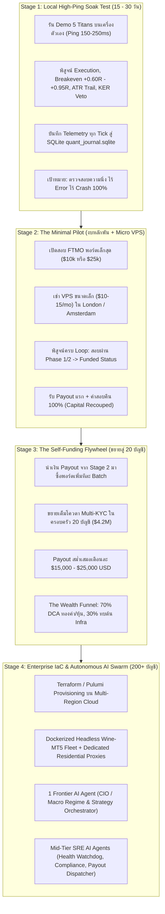
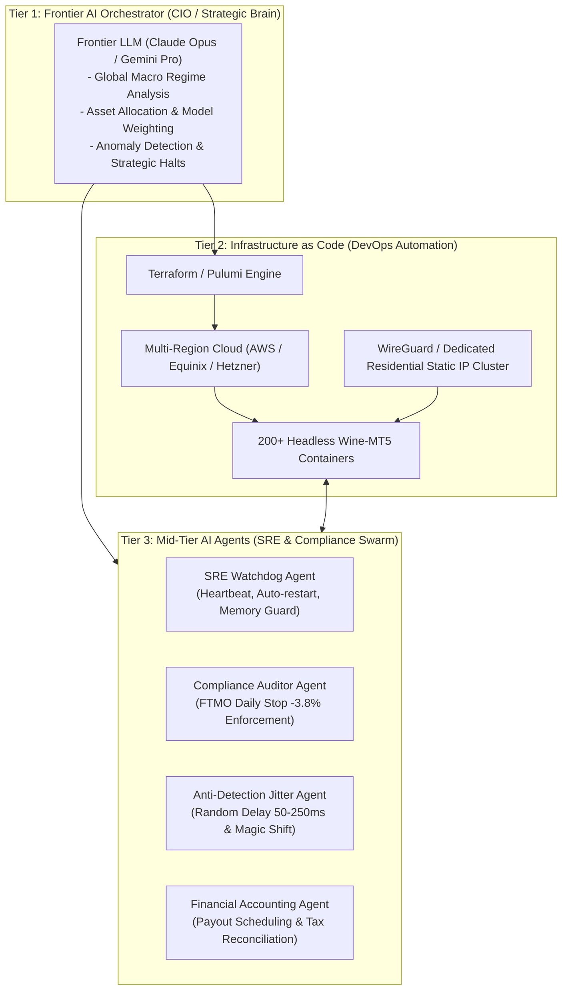

# 🏛️ MASTER ROADMAP & LONG-TERM VISION
## The Autonomous Quant Syndicate: From Local High-Ping Soak Test to 200+ Account Autonomous AI Fleet
### Architecture: Multi-Asset CFDs | Infrastructure as Code (IaC) | Hierarchical Multi-Agent AI Swarm

---

## 🌟 1. EXECUTIVE VISION & THE NORTH STAR
> **The Ultimate Goal:**  
> พัฒนาระบบบริหารจัดการพอร์ตกองทุน CFD Prop Firm อัตโนมัติเต็มรูปแบบ (Fully Automated Prop Firm Syndicate) ขยายขีดความสามารถสู่การบริหารจัดการ **200+ บัญชีพร้อมกัน ($40,000,000+ USD Buying Power)** ขับเคลื่อนด้วยโครงสร้างพื้นฐานคลาวด์แบบ **Infrastructure as Code (IaC)** และทีม **AI Multi-Agent Swarm (1 Frontier AI Orchestrator + Mid-Tier SRE Agents)** ทำหน้าที่เทรด เฝ้าระวัง และบริหารความเสี่ยงแทนมนุษย์ 100%

### แกนหลักของปรัชญาการสร้างระบบ (Core Engineering Philosophy):
1. **Risk-Free Staged Rollout:** ไม่นำเงินก้อนใหญ่ส่วนตัวมาเสี่ยง เริ่มต้นจากสภาวะที่แย่ที่สุด (Worst-case Ping) $\rightarrow$ ไปสู่การพิสูจน์โมเดลด้วยงบต่ำสุด $\rightarrow$ แล้วใช้ **"เงินกำไร Payout จากกองทุน"** มาทบต้นขยายกองเรือ (Self-Funding Compounding Flywheel)
2. **Asymmetric Capital Arbitrage:** ใช้ประโยชน์จากอัตราทดของกองทุน (Prop Firm Liquidity) ที่ความเสี่ยงต่ำกว่าการเทรดเงินสดของตัวเองหลายสิบเท่า
3. **Institutional Software Reliability:** ใช้ทักษะระดับ Senior Infrastructure / DevOps / SDET วางระบบแบบ Cloud-Native SaaS ไร้ Single Point of Failure มี Circuit Breakers ป้องกันการละเมิดกฎอย่างสมบูรณ์

---

## 🗺️ 2. THE 4-STAGE SEQUENTIAL ROADMAP

---

### 🔬 STAGE 1: LOCAL HIGH-PING SOAK TEST (15 – 30 วัน)
- **สภาพแวดล้อม:** รันบนเครื่องส่วนตัว (Local Workstation) ภายใต้สภาวะความล่าช้าจริง (Ping 150–250ms จากประเทศไทยไปยังเซิร์ฟเวอร์ยุโรป)
- **สินทรัพย์ที่ทดสอบ (The 5 Titans Upgraded Champions):**
  1. `Model_1_Gold_Specialist.mq5` (`XAUUSD`) — Donchian 40, Stop 1.2x, TP 1.50R, BE +0.95R, KER 0.25
  2. `Model_2_Nasdaq_Momentum.mq5` (`NAS100`) — Donchian 18, Stop 1.5x, TP 1.50R, BE +1.10R, KER 0.40
  3. `Model_3_Forex_Beast.mq5` (`GBPJPY`) — Donchian 9, Stop 1.0x, TP 1.75R, BE +0.60R, KER 0.12, RSI Filter
  4. `Model_4_Oil_Trend.mq5` (`USOIL`) — Donchian 24, Stop 2.2x, TP 1.75R, BE +0.60R, KER 0.15, EMA 20/50, RSI Filter
  5. `Model_5_Crypto_Alpha.mq5` (`BTCUSD`) — Donchian 30, Stop 3.5x, TP 2.50R, BE +0.80R, KER 0.35
- **เกณฑ์การผ่าน (Acceptance Criteria):**
  - รันต่อเนื่อง 15–30 วันโดย **Zero Runtime Crash**
  - Slippage และ Execution Drift อยู่ในกรอบที่รองรับได้
  - กลไก Breakeven และ Trailing Stop ทำงานตรงตาม Logic 100%
  - ไม่มีวันใดที่พอร์ตเกิด Drawdown เกินกว่า **-2.10%** (Hard stop ล็อคที่ -3.8%)

---

### 🚀 STAGE 2: THE MINIMAL PILOT (งบต่ำสุด + MICRO VPS)
- **เป้าหมาย:** พิสูจน์ Lifecycle การทำงานจริงของ Prop Firm ตั้งแต่วันแรกจนถึงวันที่เงินสดโอนเข้าบัญชีธนาคาร
- **เงินลงทุน:** ไม่เกิน \$155 – \$250 USD (ค่าสมัครพอร์ต \$10k หรือ \$25k) + ค่าเช่า VPS เดือนละ \$10 – \$15
- **การทดสอบ:**
  - ผ่าน Challenge Phase 1 (+10%) และ Phase 2 (+5%) ภายใต้ระเบียบวินัย ไม่เร่งรีบ
  - เข้าสู่สถานะ Funded Account
  - ถอนเงินกำไร (Payout) รอบแรก และ **รับเงินค่าสอบคืน 100%**
- **ผลลัพธ์:** ได้รับการยืนยันว่าระบบ Infrastructure และโมเดลการถอนเงินของจริงทำงานได้อย่างไร้รอยต่อ

---

### 🔄 STAGE 3: THE SELF-FUNDING COMPUNDING FLYWHEEL (ขยายสู่ 20 บัญชี / $4.2M)
- **เป้าหมาย:** สเกลพอร์ตสู่ขนาด **20–21 บัญชี (\$4,200,000 USD Buying Power)** โดยใช้เงินทุนที่ได้จาก Payout ใน Stage 2 ล้วนๆ
- **โครงสร้าง Multi-KYC Syndicate:**
  - กระจายชื่อผู้ถือพอร์ตในครอบครัว 10–11 คน (KYC ละ \$400k ตามกฎเพดานสูงสุดของ FTMO)
- **สถิติทางการเงินที่คาดการณ์ (Empirical Expectations):**
  - ด้วยขนาดพอร์ต \$4.2M ที่ระดับความเสี่ยง 1.00% (Max DD 10 ปี อยู่ที่เพียง 5.33%):
  - ผลตอบแทนเฉลี่ยเดือนละ +0.8% ถึง +1.5% $\rightarrow$ กำไร \$33,000 – \$63,000 USD/เดือน
  - ส่วนแบ่งกำไร 80% หลังหักค่าใช้จ่าย = **\$26,000 – \$50,000 USD/เดือน (~900,000 – 1,750,000 บาท/เดือน)**
- **The Wealth Funnel Strategy:**
  - **70% ของ Payout:** โอนเงินสดออกจากระบบทันที นำไป DCA สะสมทองคำแท่ง (Physical Bullion) และกองทุนดัชนี S&P 500 ETF (SPY/VOO)
  - **30% ของ Payout:** นำมาทบต้นขยายโครงสร้างพื้นฐานเซิร์ฟเวอร์ และเตรียมความพร้อมสู่ Stage 4

---

### 🤖 STAGE 4: ENTERPRISE IaC & AUTONOMOUS AI AGENT SWARM (200+ บัญชี / $40M+)
- **เป้าหมาย:** เปลี่ยนจากการดูแลด้วยมือ สู่ระบบ **Autonomous Sovereign Quantitative Operation**

---

## 🛡️ 3. CORE INVARIANTS & RISK RULES (กฎเหล็กห้ามละเมิด)

| กฎเหล็ก | ขอบเขตการทำงาน | การบังคับใช้ |
| :--- | :--- | :--- |
| **Capital Protection First** | เงินสดส่วนตัวไม่เสี่ยงก้อนใหญ่ | คืนทุนก่อนขยายต่อเสมอ |
| **Daily Hard Stop -3.8%** | ป้องกันกฎ Daily Loss ของกองทุน (ห้ามแตะ -4.0% หรือ -5.0%) | ควบคุมด้วย `QuantMasterPortfolioGuard.mqh` |
| **Rollover Spread Blackout** | บล็อกการเทรด 23:50 – 00:20 Server Time (04:50 - 05:20 น.) | ป้องกันสเปรดถ่างกิน Stop Loss ฟรี |
| **Dynamic Correlation Guard** | บล็อกการเปิด Buy/Sell ทิศทางเดียวกันในคู่ที่สัมพันธ์สูง (NAS vs BTC) | ควบคุมอัตโนมัติใน `CanOpenNewPosition()` |
| **Zero CSV Policy** | ข้อมูลการเทรดและวิจัยทั้งหมด | จัดเก็บใน SQLite (`quant_vault.db` / `quant_journal.sqlite`) |
| **Zero DLL Policy** | โค้ด MQL5 ทั้งหมด | ต้องคอมไพล์ Native 100% ไร้ DLL เพื่อรันบน Linux/VPS ได้สมบูรณ์ |
| **Anti-Detection Isolation** | การก๊อปปี้เทรดข้ามบัญชี | ต้องมี Random Jitter (50–250ms) และ Magic Number เฉพาะตัวเสมอ |

---

## 📌 4. CURRENT STATUS & IMMEDIATE ACTION
- [x] โมเดล 5 Titans คอมไพล์เสร็จสมบูรณ์ 0 Errors, 0 Warnings
- [x] อัปเกรดจุดอ่อน M3 (GBPJPY) และ M4 (USOIL) ด้วย RSI Filter และ Fast Breakeven สำเร็จ
- [x] ฝัง Rollover Spread Blackout และ Dynamic Correlation Guard สำเร็จ
- [x] ตรวจสอบผลงาน 10.75 ปี (2016–2026) ที่ Risk 1.00% ได้กำไร +217.3% Max Daily Loss -2.10% ผ่านเกณฑ์ A+
- [x] บันทึกพิมพ์เขียวแม่บทลงใน `MASTER_ROADMAP_AND_GOAL.md`
- [ ] **NEXT STEP:** เริ่มต้น **Stage 1 (Local Demo Soak Test 15–30 วัน)** บนเครื่องของคุณ
