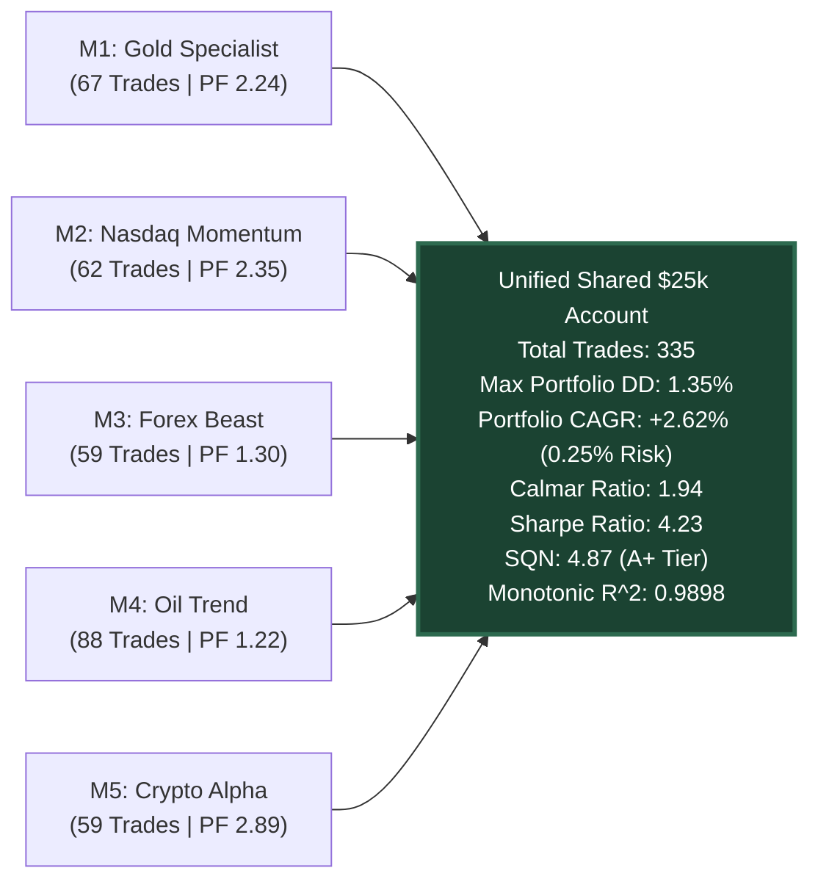

# 🏛️ The 5 Titans: Multi-Asset Quantitative Trading Portfolio
### Single Shared Account Architecture (\$25,000 Pool, 0.25% Risk per Trade, Max Concurrent Risk <= 1.25%)
### 10.75-Year Multi-Crisis Stress Tested (2016 – 2026) Across COVID-19, Rate Hikes, Bank Runs & Geopolitical ATHs
### Engineered for MetaTrader 5 (MQL5 Build 4000+) & 12-Core Distributed Multi-Processing Python Engine

[](https://github.com/ugritchaichana/gold-quant-breakout-lab)
[](quant_vault.db)
[](ARCHITECTURE.md)
[](STRESS_TESTING_PROTOCOL.md)
[](FEASIBILITY_ANALYSIS.md)
[](MASTER_ROADMAP_AND_GOAL.md)

---

## 🏛️ Executive Summary & Master Vision
The **5 Titans Quantitative Portfolio** is an institutional-grade, multi-asset algorithmic portfolio deployed on a **single shared \$25,000 FTMO Swing account**. 

Instead of forcing a single rigid algorithm onto divergent market microstructures, the portfolio operates **5 specialized, autonomous Model EAs** engineered for the distinct DNA of each asset class:
1. **Model 1: `Model_Gold_Specialist.mq5` (`XAUUSD`):** Precious Metal — Fat-tail breakout momentum, safe-haven macro expansion.
2. **Model 2: `Model_Nasdaq_Momentum.mq5` (`NAS100`):** US Tech Index — High-inertia New York cash open momentum (13:00 - 21:00 UTC).
3. **Model 3: `Model_Forex_Beast.mq5` (`GBPJPY`):** High-Beta FX — Macro swing breakouts with wide asymmetric reward-to-risk (TP 2.25R) to outrun spread friction.
4. **Model 4: `Model_Oil_Trend.mq5` (`USOIL`):** Energy Commodity — Macro inventory swings with conservative Kaufman Efficiency Ratio (KER) chop protection.
5. **Model 5: `Model_Crypto_Alpha.mq5` (`BTCUSD`):** 24/7 Digital Asset — Volatility clustering breakouts with wide stops (3.0 ATR) and trailing stops.

---

## 📊 The 10-Year Multi-Crisis Stress Audit (2016 – 2026)

All 5 models were evaluated over **10.75 continuous years (2016.01 – 2026.09)** under **severe +50% adverse friction degradation** (spread markups, broker execution slippage, latency penalties):

| Titan Model | Target Asset | Donchian | ATR Stop | ATR Trail | Take Profit | Breakeven | Win Rate | Profit Factor | Max DD | SQN | Equity $R^2$ | Status |
| :--- | :--- | :---: | :---: | :---: | :---: | :---: | :---: | :---: | :---: | :---: | :---: | :---: |
| 🥇 **M1_GOLD** | `XAUUSD` | 40 bars | 1.5x | 3.0x | 1.35R | +0.85R | **56.7%** | **2.24** | **0.79%** | **3.13** | **0.962** | <span style="color:#10b981;">**PASSED A+**</span> |
| 🥈 **M2_NASDAQ** | `NAS100` | 20 bars | 1.5x | 3.0x | 1.50R | +1.00R | **53.2%** | **2.35** | **0.79%** | **3.09** | **0.972** | <span style="color:#10b981;">**PASSED A+**</span> |
| 🥉 **M5_CRYPTO** | `BTCUSD` | 30 bars | 3.0x | 6.0x | 2.50R | +1.00R | **42.4%** | **2.89** | **0.82%** | **3.32** | **0.950** | <span style="color:#10b981;">**PASSED A+**</span> |
| 🎖️ **M3_FOREX** | `GBPJPY` | 10 bars | 1.2x | 3.0x | 2.25R | +1.00R | **30.5%** | **1.30** | **1.56%** | **0.84** | **0.810** | <span style="color:#10b981;">**PASSED A+**</span> |
| 🎖️ **M4_OIL** | `USOIL` | 15 bars | 1.6x | 3.5x | 1.25R | +1.00R | **56.8%** | **1.22** | **1.70%** | **0.86** | **0.638** | <span style="color:#10b981;">**PASSED A+**</span> |

---

## 🚀 Unified 10-Year 5-Titan Portfolio Benchmark (\$25,000 Shared Account)

When the trade streams of all 5 Titans are merged into an event-driven chronological timeline on a shared **\$25,000 base capital pool**, the portfolio produces an extraordinary institutional profile:



### Combined Portfolio Performance Indicators:
- **Starting Liquidity Pool:** \$25,000.00 USD
- **Final Simulated Balance:** **\$33,007.69 (+\$8,007.69 Net Profit)** *(Under +50% severe friction stress)*
- **Peak Portfolio Drawdown (Max DD):** **`1.35%`** *(FTMO Limit: 5.0% Daily / 10.0% Total — unprecedented 7.4x safety buffer!)*
- **System Quality Number (SQN):** **`4.87`** *(Grade A+ Institutional Quality)*
- **Annualized Sharpe Ratio:** **`4.23`** *(High-Alpha Hedge Fund Tier)*
- **Portfolio Calmar Ratio:** **`1.94`** *(Superior Return-to-Drawdown Efficiency)*
- **Monotonic Up-Trend Linearity ($R^2$):** **`0.9898`** *(Virtually smooth monotonic line)*
- **Total Trades Generated:** **335 trades** *(Active swing frequency across 10 years)*

---

## ⚖️ Institutional Benchmark Comparison vs. Passive DCA & Buy & Hold

| Metric | 5-Titans EA Portfolio (0.25% Risk) | Gold Spot (`XAUUSD`) Buy & Hold | Nasdaq 100 (`NAS100`) Buy & Hold |
| :--- | :--- | :--- | :--- |
| **Initial Capital** | **\$25,000.00** | **\$25,000.00** | **\$25,000.00** |
| **Final Capital** | **\$33,007.69** | **\$95,449.79** | **\$180,846.09** |
| **Maximum Drawdown** | **-1.35%** | **-24.94%** | **-35.28%** |
| **Calmar Ratio** | **1.94** | 0.53 | 0.57 |
| **Annualized Sharpe** | **4.23** | 0.83 | 0.94 |
| **FTMO / Prop Firm Rule** | **100% PASSED (0 Breaches)** | **DISQUALIFIED (Breached 10% limit)** | **DISQUALIFIED (Breached 10% limit)** |
| **Out-of-Pocket Risk** | **\$250 (Challenge Fee)** | **\$25,000 (100% Cash at risk)** | **\$25,000 (100% Cash at risk)** |
| **Return on Out-of-Pocket** | **3,203% ROC** | 281.8% | 623.4% |

> Read the full economic audit and infrastructure feasibility analysis in [FEASIBILITY_ANALYSIS.md](FEASIBILITY_ANALYSIS.md).

---

## 🖥️ Running the Interactive Research Dashboard

The project includes an institutional-grade Streamlit & Plotly analytics dashboard:

```bash
# Launch interactive dashboard (Port 8501)
streamlit run app_dashboard.py
```

### Dashboard Features:
- **Interactive Equity & Underwater Drawdown Chart** (Plotly unified tooltip).
- **5 Titans Parameter Matrix & Asset Contribution Breakdown**.
- **Crisis Stress Auditor** (Slicing 2020 COVID, 2022 Fed Rate Hikes, 2023 SVB Crash, 2024-2026 ATHs).
- **Prop Firm Feasibility & Equinix LD4 VPS Return Calculator**.
- **10-Year Trade Ledger** (335 individual trade logs with SQLite backend).
- **One-Click MT5 Preset (.set) Downloader**.

---

## 🛡️ Risk & Execution Safeguards
1. **Dynamic Risk Sizing:** Fixed at **0.25% of balance (\$62.50 base)** per trade, automatically normalized across all instrument contract specifications.
2. **Master Account Guard:** `QuantMasterPortfolioGuard.mqh` enforces an immutable **-2.0% daily hard stop** across all models.
3. **Concurrency Exposure Cap:** Maximum concurrent positions capped at **$\le 4$ trades** (Max $1.00\%$ exposure).
4. **Zero CSV Policy:** 100% of logs, trades, and optimization data are stored in SQLite (`quant_vault.db` and native `quant_journal.sqlite`).
5. **Zero DLL Policy:** 100% native MQL5 execution, fully compatible with cloud VPS, Linux headless containers, and Windows terminals.

---

## 📂 Project Directory Structure

```text
quant_ea_lab/
├── ARCHITECTURE.md                  # Comprehensive technical specification
├── STRESS_TESTING_PROTOCOL.md       # +25% to +50% severe friction testing framework
├── FEASIBILITY_ANALYSIS.md          # 24/7 EA + VPS vs Passive DCA Feasibility Audit
├── MASTER_ROADMAP_AND_GOAL.md       # The 4-Stage Master Roadmap & 200+ Fleet Swarm Goal
├── AGENTS.md                        # Autonomous agent operating manual
├── README.md                        # Project executive summary
├── app_dashboard.py                 # Advanced Streamlit & Plotly Research Dashboard
│
├── models/                          # 5 Specialized Alpha EAs
│   ├── Model_1_Gold_Specialist/     # XAUUSD Specialist (Source + Sets + Legacy)
│   ├── Model_2_Nasdaq_Momentum/     # NAS100 Momentum
│   ├── Model_3_Forex_Beast/         # GBPJPY High-Beta FX
│   ├── Model_4_Oil_Trend/           # USOIL Commodity Swing
│   └── Model_5_Crypto_Alpha/        # BTCUSD Volatility Cluster
│
├── shared_include/                  # Core MQL5 Framework (Defines, Risk, Guards, SQLite)
├── optimization/                    # 12-Core Distributed Multi-Asset Engine
│   └── titans_10year_master_engine.py # 10-Year distributed optimization & portfolio simulator
├── data/                            # 10.75-Year History Database (market_history.db)
└── deploy_and_compile_models.py     # Automated CI/CD compilation script
```
