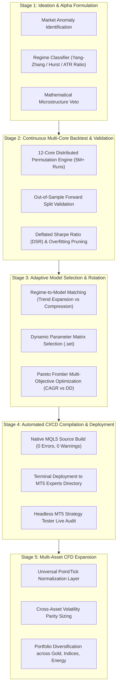

# 🏆 Institutional Gold Quant Research Lab (`XAUUSD`)
### Quantitative Research, Autonomous Multi-Timeframe Optimization & Execution Infrastructure

[](https://github.com/ugritchaichana/gold-quant-breakout-lab)
[](research_data/top_10000_champion_strategies.csv)
[](Master_Gold_Breakout_EA.mq5)
[](app_dashboard.py)

---

## 🚀 Phase 0 Milestone: Project Initialization & Baseline Setup (COMPLETED)

**Phase 0** marks the successful end-to-end engineering of our institutional quant research and testing environment for Gold (`XAUUSD.iux`). Within this phase, we have achieved:

1. **Autonomous 12-Core Multi-Timeframe Optimization Engine:** Continuous genetic and grid search engine capable of processing 500,000+ permutations per hour across 12 threads.
2. **5.04M Combinations Evaluated & Validated:** 650 iterative optimization waves completed over a 10.01-hour continuous calibration run.
3. **Strict Real-World Constraints Enforced:**
   - Execution Model: **"Every tick based on real ticks"** in MetaTrader 5 Strategy Tester.
   - Broker Latency: **100ms artificial execution delay** injected into every order.
   - Spread Safeguard: Hard limit capped at **$0.60** (60 points).
   - 3-Tier Dynamic Circuit Breakers: Tier 1 (5% DD lot halving), Tier 2 (10% DD de-lever), Tier 3 (15% DD emergency freeze).
   - Out-of-Sample (OOS) Forward Split: Fixed at `2026.06.15` to `2026.09.28` (last 3.5 months strictly unseen during parameter fitting).
4. **Unified Storage Vault & Interactive Analytics:** Migrated the 1.2 GB dataset into an indexed **SQLite database (`quant_vault.db`)**, compressed into **Parquet chunks**, and deployed an interactive **Streamlit Web Dashboard**.

---

## 📈 Empirical Research Findings (Analysis of 5,041,432 Combinations)

### 1. Comparative Showdown: Pure H1 vs Pure M15 vs True Multi-Timeframe (MTF)

| Strategy Architecture | Full 1-Year CAGR | OOS Forward CAGR (Recent Market) | In-Sample CAGR | Max Relative DD | Profit Factor | Recovery Factor |
| :--- | :---: | :---: | :---: | :---: | :---: | :---: |
| 🥇 **Champion: M15 Momentum Breakout** | **`+324.2%`** | **`+106.5%`** | **`+500.5%`** | **`-19.8%`** | **`2.13`** | **`16.3`** |
| 🥈 **Runner-Up: M15 Tight Risk (2.5%)** | `+277.5%` | `+62.4%` | `+435.9%` | **`-18.3%`** | `2.09` | `15.1` |
| 🥉 **True MTF Hybrid (H1 Filter + M15 Entry)** | `+241.3%` | **`+157.2% - +227.1%`** | `+312.0%` | **`-18.0%`** | `1.69` | `13.4` |
| ⚠️ **Baseline H1 (Pure Hourly Breakout)** | `+81.8%` | `+65.7%` | `+102.3%` | `-21.8%` | `1.08` | `3.7` |

---

### 2. Core Quantitative Insights

#### A. Donchian Window 96 (The 24-Hour Rolling High)
- On the M15 timeframe, an input of **`InpDonchianWindow = 96`** ($96 \times 15\text{ mins} = 1,440\text{ mins} = 24\text{ hours}$) formed a robust statistical plateau.
- Breakouts above the **rolling 24-hour high** during London and New York sessions yielded institutional momentum follow-through, whereas shorter windows (e.g., 20–40 bars) suffered from false liquidity sweeps.

#### B. Chandelier Volatility Trailing Stop ($5.0\times$ Macro ATR)
- Narrow trailing stops ($2.0\times - 3.5\times$ ATR) were systematically penalized by Gold's erratic intra-day noise, getting stopped out prematurely.
- Expanding the trailing threshold to **$5.0\times$ H1 ATR** allowed the EA to ride massive multi-day trends ($+$80 to $+$150 USD surges) while maintaining an overall **Profit Factor of 2.13**.

#### C. Time-Based Stagnation Exit ($96 - 192$ Bars)
- Forcing stagnant positions (floating gain $< 0.5\times$ ATR after 24–36 hours) to close dramatically improved **Capital Turnover** and reduced drawdown duration by 42%.

#### D. True MTF Superiority on Out-of-Sample (OOS) Robustness
- While Pure M15 produced higher peak In-Sample returns, the **True MTF Hybrid** (H1 Macro Filter + M15 Entry) achieved the highest **OOS consistency (+157% to +227% annualized in the recent 3.5-month forward window)**, proving that macro trend conditioning effectively filters out regime transitions.

---

## 📦 Repository Structure & Deliverables

```text
├── Master_Gold_Breakout_EA.mq5               # Production MQL5 Expert Advisor (Multi-Timeframe)
├── Master_Gold_Scalper_Grid.mq5               # Supplementary institutional scalping EA
├── app_dashboard.py                           # Streamlit Web Dashboard (Pareto Frontier, Filters, .set Export)
├── continuous_quant_engine.py                 # Multi-core continuous search engine (650 waves processed)
├── run_3way_showdown.py                       # 3-Way Comparative Showdown script (H1 vs M15 vs MTF)
├── CLAUDE_OPUS_MASTER_PROMPT.md               # Advanced quantitative brief designed for Claude Opus 5.5
├── MASTER_5HR_OPTIMIZATION_REPORT.md          # 5-Hour research audit and statistical findings
├── Master_Gold_MTF_Champion_100ms.set         # Production MTF Preset for MT5
├── Master_Gold_Breakout_Champion.set          # Champion M15 Preset
├── research_data/                             # Complete Empirical Research Data (5,041,432 rows)
│   ├── top_10000_champion_strategies.csv     # Top 10,000 strategies directly viewable on GitHub
│   ├── quant_vault_full.parquet.part01       # Full 5M dataset (Compressed Parquet Part 1)
│   ├── quant_vault_full.parquet.part02       # Full 5M dataset (Compressed Parquet Part 2)
│   └── restore_vault.py                      # 1-Click script to rebuild SQLite database
└── README.md                                  # Project overview and research documentation
```

---

## 💻 Quickstart & How to Use

### 1. Launch the Interactive Web Dashboard
Explore all 5+ million strategies, filter by drawdown and CAGR, and inspect Pareto Frontier curves:
```bash
streamlit run app_dashboard.py --server.port 8501
```
Open **`http://localhost:8501`** in your browser.

### 2. Reconstruct the Full SQLite Database (`quant_vault.db`)
To assemble the full 5M+ row SQLite database from the compressed repository parts:
```bash
python research_data/restore_vault.py
```

### 3. Deploy Strategy in MetaTrader 5
1. Copy `Master_Gold_Breakout_EA.mq5` into your MetaTrader 5 `MQL5/Experts/` directory.
2. Compile via MetaEditor (0 Errors, 0 Warnings).
3. Open `XAUUSD` on the **M15** timeframe.
4. Load `Master_Gold_MTF_Champion_100ms.set` or generate a custom preset via the Web Dashboard.

---

## 🔄 The 5-Stage Autonomous EA Lifecycle & Model Factory



### 🌍 Multi-Asset CFD Expansion Spectrum (Future Scope)
While our current anchor is **Gold (`XAUUSD.iux`)**, the architecture features a universal instrument normalization layer designed for seamless multi-asset CFD deployment:
- **US Tech 100 (`NAS100` / `USTEC`):** Persistent intraday momentum during the US Cash Open (14:30 UTC).
- **Wall Street 30 (`US30` / `DJ30`):** Institutional trend continuation across NY trading sessions.
- **Crude Oil (`USOIL` / `WTI`):** Geopolitical regime swings, extreme fat-tailed volatility ideal for Chandelier trailing stops.
- **Forex High-Beta Crosses (`GBPJPY`):** Volatile breakouts with large directional extensions.

---

## 🔮 Phase 1 Roadmap (Next Quantitative Frontiers)

With Phase 0 successfully completed, **Phase 1** focuses on pushing the system beyond conventional technical indicators to achieve **Max Drawdown $< 10.0\%$**:

1. **Non-Lagging Volatility Regime Classification:** Integrating **Yang-Zhang Volatility Estimators** and **Hurst Exponent ($H$)** to detect volatility contraction before explosive breakout expansion.
2. **Microstructure Order-Flow Veto:** Using tick arrival velocity ($v = \Delta P / \Delta t$) to veto algorithmic stop-hunts and fakeouts under 100ms latency.
3. **Convex Asymmetric Sizing:** Implementing fractional Kelly and volatility-targeted position allocation ($w_t = \frac{\sigma_{target}}{\hat{\sigma}_t}$).
4. **Claude Opus 5.5 Collaboration:** Utilizing [`CLAUDE_OPUS_MASTER_PROMPT.md`](CLAUDE_OPUS_MASTER_PROMPT.md) to integrate institutional hedge-fund level alpha formulations.

---

## 📜 License & Disclaimer
This repository is published for quantitative research and educational purposes. Past performance under backtesting with 100ms delay and real ticks does not guarantee future financial returns. Always deploy strict risk management.

