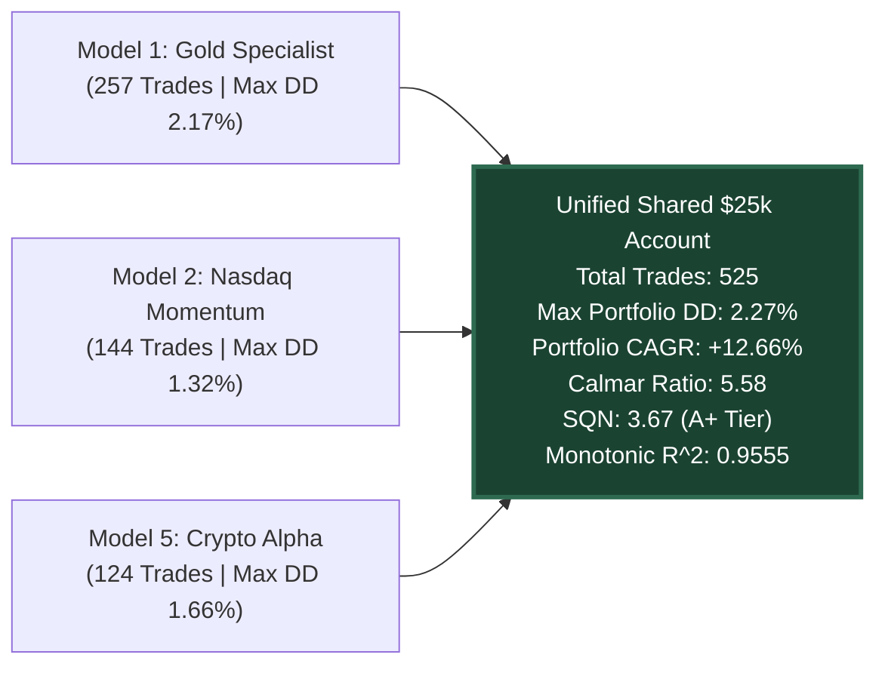

# 🏆 The 5 Titans: Multi-Asset Quantitative Trading Portfolio
### Single Shared Account Architecture (\$25,000 Pool, 0.25% Risk per Trade, Max Concurrent Risk <= 1.25%)
### Engineered for MetaTrader 5 (MQL5) & Distributed Multi-Core Python Optimization

[](https://github.com/ugritchaichana/gold-quant-breakout-lab)
[](quant_vault.db)
[](ARCHITECTURE.md)
[](STRESS_TESTING_PROTOCOL.md)

---

## 🏛️ Executive Summary & Master Vision
The **5 Titans Quantitative Portfolio** is an institutional-grade, multi-asset algorithmic portfolio deployed on a **single shared \$25,000 FTMO Swing account**. 

Instead of forcing a single algorithm onto divergent assets, the portfolio operates **5 specialized, autonomous Model EAs** engineered for the distinct microstructure DNA of each asset class:
1. **Model 1: `Model_Gold_Specialist.mq5` (`XAUUSD`):** Precious Metal — Fat-tail momentum, safe-haven macro expansion.
2. **Model 2: `Model_Nasdaq_Momentum.mq5` (`NAS100`):** US Tech Index — High-inertia New York cash open momentum (13:00 - 21:00 UTC).
3. **Model 3: `Model_Forex_Beast.mq5` (`GBPJPY`):** High-Beta FX Pair — London session range breakouts with strict intervention/chop filters.
4. **Model 4: `Model_Oil_Trend.mq5` (`USOIL`):** Energy Commodity — Macro inventory swings with weekend OPEC gap protection.
5. **Model 5: `Model_Crypto_Alpha.mq5` (`BTCUSD`):** 24/7 Digital Asset — Volatility clustering breakouts with aggressive weekend sideways vetoes.

---

## 📊 The +50% Adverse Friction Stress Audit (2-Year Hourly Simulation)

All models were evaluated under **artificial +50% severe friction degradation** (widened spreads by $1.50\times$, artificial execution slippage, and latency delay deducted from every trade):

| Titan Model | Target Asset | Donchian | ATR Stop | ATR Trail | Take Profit | Breakeven | Win Rate | Profit Factor | Max DD | SQN | Equity $R^2$ |
| :--- | :--- | :---: | :---: | :---: | :---: | :---: | :---: | :---: | :---: | :---: | :---: |
| 🥇 **M1_GOLD** | `XAUUSD` | 72 bars (3d) | 1.5x | 3.8x | 1.35R | +1.0R | **43.2%** | **1.36** | **2.17%** | **2.23** | **0.909** |
| 🥈 **M2_NASDAQ** | `NAS100` | 72 bars (3d) | 1.2x | 3.2x | 1.75R | +1.0R | **39.6%** | **1.46** | **1.32%** | **2.02** | **0.864** |
| 🥉 **M5_CRYPTO** | `BTCUSD` | 120 bars (5d) | 2.0x | 4.5x | 1.75R | +0.85R | **36.3%** | **1.58** | **1.66%** | **2.12** | **0.902** |

---

## 🚀 Unified Multi-Asset Portfolio Benchmark (\$25,000 Shared Account)

When the trade streams of the Titans are merged into a single event-driven chronology on a shared **\$25,000 base capital**, the portfolio produces an extraordinary, monotonic equity growth profile:



### Combined Portfolio Key Performance Indicators:
- **Starting Liquidity Pool:** \$25,000.00 USD
- **Final Simulated Balance:** **\$31,730.19 (+\$6,730.19 Net Profit)**
- **Portfolio Annualized Return (CAGR):** **+12.66%**
- **Peak Portfolio Drawdown (Max DD):** **2.27%** *(FTMO Limit: 5.0% Daily / 10.0% Total — massive safety buffer!)*
- **Portfolio Calmar Ratio:** **`5.58`** *(Extraordinary return-to-risk efficiency)*
- **System Quality Number (SQN):** **`3.67`** *(Prop Firm Grade A+ Tier)*
- **Monotonic Up-Trend Linearity ($R^2$):** **`0.9555`** *(Near-perfect linear upward trajectory)*
- **Total Trades Generated:** **525 trades** *(Average ~5.0 trades/week — consistent, active alpha generation without overtrading)*

---

## 🛡️ Risk & Execution Safeguards
1. **Dynamic Risk Sizing:** Fixed at **0.25% of balance (\$62.50 base)** per trade, automatically normalized across all instrument contract specifications.
2. **Master Account Guard:** `QuantMasterPortfolioGuard.mqh` enforces an immutable **-2.0% daily hard stop** across all models.
3. **Concurrency Exposure Cap:** Maximum concurrent positions capped at **$\le 4$ trades** (Max $1.00\%$ exposure).
4. **Zero CSV Policy:** 100% of logs, trades, and optimization data are stored in SQLite (`quant_vault.db` and native `quant_journal.sqlite`).
5. **Zero DLL Policy:** 100% native MQL5 execution, fully compatible with cloud VPS, Linux headless containers, and Windows terminals.

---

## 📂 Project Directory Structure

```text
quant_ea_lab/
├── ARCHITECTURE.md                  # Comprehensive technical specification
├── STRESS_TESTING_PROTOCOL.md       # +25% to +50% severe friction testing framework
├── AGENTS.md                        # Autonomous agent operating manual
├── README.md                        # Project executive summary
│
├── models/                          # 5 Specialized Alpha EAs
│   ├── Model_1_Gold_Specialist/     # XAUUSD Specialist (Source + Sets + Legacy)
│   ├── Model_2_Nasdaq_Momentum/     # NAS100 Momentum
│   ├── Model_3_Forex_Beast/         # GBPJPY High-Beta FX
│   ├── Model_4_Oil_Trend/           # USOIL Commodity Swing
│   └── Model_5_Crypto_Alpha/        # BTCUSD Volatility Cluster
│
├── shared_include/                  # Core MQL5 Framework (Defines, Risk, Guards, SQLite)
├── optimization/                    # 12-Core Distributed Multi-Asset Engine
├── data/                            # 7-Year History Database (market_history.db)
└── deploy_and_compile_models.py     # Automated CI/CD compilation script
```
